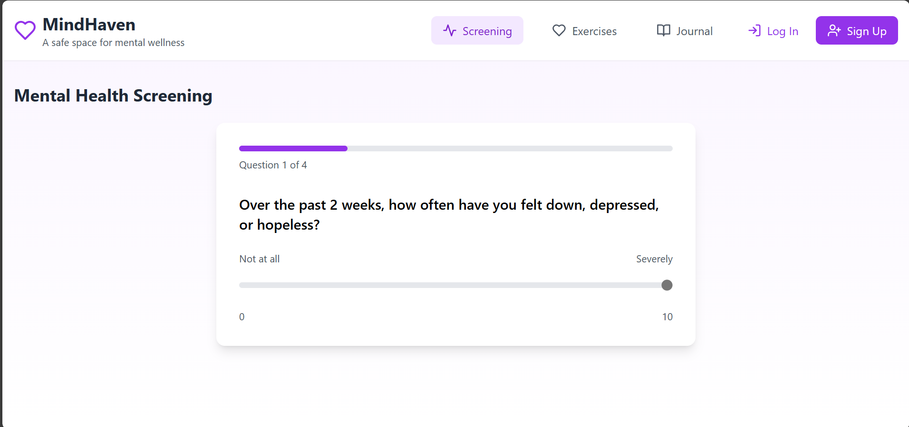

# MindHaven



MindHaven is an innovative online mental health support platform designed to address the stigma, inaccessibility, and high costs associated with traditional mental health resources. By providing a safe, anonymous, and user-friendly environment, MindHaven empowers individuals to take charge of their mental well-being.

## Problem Statement
Many people struggle to access mental health resources due to societal stigma, financial barriers, and a lack of awareness. These challenges often prevent individuals from seeking timely help. MindHaven seeks to bridge this gap by offering a platform that is accessible, anonymous, and equipped with tools to support mental wellness.

## Solution
MindHaven combines AI technology, professional expertise, and community support to create a holistic mental health platform. By integrating mental health screenings, counseling connections, and stress-relief exercises, the app delivers practical solutions tailored to diverse user needs.

## Features

### Core Features:
- **Anonymous AI-Powered Mental Health Screenings**
  - Users answer guided questions to assess their mental health.
  - AI utilizes Natural Language Processing (NLP) to provide insights and personalized recommendations.

- **Certified Counselor or Peer Support Group Connections**
  - Access to a directory of licensed mental health professionals for one-on-one consultations.
  - Peer support groups offer a community for shared experiences.
  - In-app booking system with appointment reminders.

- **Stress-Relief Exercises**
  - Guided mindfulness meditations with customizable durations.
  - Journaling tools with mood tracking to encourage self-reflection.
  - Breathing exercises supported by visual and audio aids.

### Optional Features:
- **Daily Affirmations**: AI-generated motivational messages.
- **Gamified Mental Wellness Goals**: Rewards for completing exercises and engaging with the platform.
- **Emergency Contact Feature**: Quick access to crisis hotlines based on user location.

## Technologies

### Frontend:
- React framework for a responsive and accessible user interface.

### Backend:
- Node.js for server-side logic and APIs.
- MySQL database for secure data management.

### AI/ML:
- OpenAI GPT and Hugging Face NLP tools for mental health screening and sentiment analysis.

### Third-Party APIs:
- Google Calendar API for appointment scheduling.
- Stripe/PayPal for secure payment processing.
- Twilio for notifications and reminders.

## Setup and Usage Instructions

### Prerequisites
- Ensure Node.js and MySQL are installed on your system.

### Steps to Set Up:
1. **Clone the Repository:**
   ```bash
   git clone https://github.com/yourusername/mindhaven.git
   cd mindhaven
   ```

2. **Install Dependencies:**
   ```bash
   npm install
   ```

3. **Configure Environment Variables:**
   Create a `.env` file with the necessary API keys and database credentials.

4. **Run the Application:**
   ```bash
   npm start
   ```

5. **Access the Platform:**
   Open `http://localhost:3000` in your web browser.

## Impact
- **Accessibility:** Breaks down barriers to mental health resources for underserved communities.
- **Anonymity:** Encourages help-seeking behavior by protecting user identity.
- **Scalability:** Designed to include multilingual support and culturally relevant content for global reach.

## Project Demo
- **Live Demo:** [[LIVE LINK](https://mind-haven-ai.vercel.app/)]
- **Demo Video:** [Add Video Link]

## License
This project is licensed under the MIT License. See the LICENSE file for details.

---
We welcome your contributions! Submit issues or pull requests on GitHub to help us enhance MindHaven.
